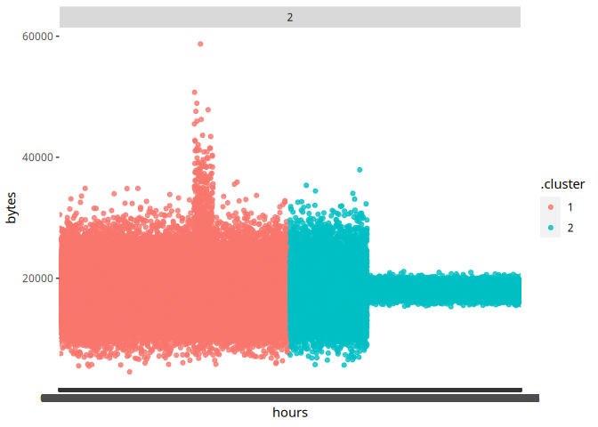

``` r
library(stringr)
library(tidymodels)
library(arrow)
library(dplyr)
library(ggplot2)
```

# Задание 2: Надите утечку данных 2

Другой атакующий установил автоматическую задачу в системном
планировщике cron для экспорта содержимого внутренней wiki системы. Эта
система генерирует большое количество траффика в нерабочие часы, больше
чем остальные хосты. Определите IP этой системы. Известно, что ее IP
адрес отличается от нарушителя из предыдущей задачи

## Импортируем датасет

``` r
df_data <- arrow::read_csv_arrow("/home/archer/Documents/ML/traffic_security.csv")
```

## Дадим имена признакам

``` r
colnames(df_data) <- c('timestamp','src','dst','port','bytes')
head(df_data,3)
```

    ## # A tibble: 3 × 5
    ##       timestamp src           dst           port bytes
    ##         <int64> <chr>         <chr>        <int> <int>
    ## 1 1578326400005 16.79.101.100 12.48.65.39     92 11895
    ## 2 1578326400007 18.43.118.103 14.51.30.86     27   898
    ## 3 1578326400011 15.71.108.118 14.50.119.33    57  7496

## Очистим датасет, оставив в src ip-адреса, только нашего предприятия

``` r
knitr::opts_chunk$set(
  df_data <- df_data[df_data$src > 11 & df_data$src < 15 & df_data$dst < 11 | df_data$dst > 15, ]
)
```

## Удаление IP из задания 1

``` r
knitr::opts_chunk$set(
  df_data <- df_data[!(df_data$src=="13.37.84.125"),]
)
head(df_data,3)
```

    ## # A tibble: 3 × 5
    ##       timestamp src           dst          port bytes
    ##         <int64> <chr>         <chr>       <int> <int>
    ## 1 1578326400012 14.33.30.103  15.24.31.23   115 20979
    ## 2 1578326400018 12.46.104.126 16.25.76.33   123  1500
    ## 3 1578326400021 12.43.98.93   18.85.31.68    79   979

## Извлечение часов

``` r
knitr::opts_chunk$set(
  df_data$timestamp <- as.POSIXct(df_data$timestamp/1000, origin = "1970-01-01", tz = "GMT")
)
head(df_data,3) 
```

    ## # A tibble: 3 × 5
    ##   timestamp           src           dst          port bytes
    ##   <dttm>              <chr>         <chr>       <int> <int>
    ## 1 2020-01-06 16:00:00 14.33.30.103  15.24.31.23   115 20979
    ## 2 2020-01-06 16:00:00 12.46.104.126 16.25.76.33   123  1500
    ## 3 2020-01-06 16:00:00 12.43.98.93   18.85.31.68    79   979

## Удаление NA

``` r
knitr::opts_chunk$set(
  df_data <- na.omit(df_data)
)
```

## Извлекаем часы и байты

``` r
knitr::opts_chunk$set(
  df_data_hours_bytes <- tibble(hours = format(as.POSIXct(df_data$timestamp), format = "%H%M%S"),
                                bytes = df_data$bytes)
)
head(df_data_hours_bytes,3)
```

    ## # A tibble: 3 × 2
    ##   hours  bytes
    ##   <chr>  <int>
    ## 1 160000 20979
    ## 2 160000  1500
    ## 3 160000   979

## Разбиваем время на часы минуты и секунды

``` r
knitr::opts_chunk$set(
  df_data$hour <- with (df_data,format(as.POSIXct(df_data$timestamp), format = "%H")),
  df_data$minutes <- with (df_data,format(as.POSIXct(df_data$timestamp), format = "%M")),
  df_data$sec <- with (df_data,format(as.POSIXct(df_data$timestamp), format = "%S"))
)
head(df_data,3)
```

    ## # A tibble: 3 × 8
    ##   timestamp           src           dst          port bytes hour  minutes sec  
    ##   <dttm>              <chr>         <chr>       <int> <int> <chr> <chr>   <chr>
    ## 1 2020-01-06 16:00:00 14.33.30.103  15.24.31.23   115 20979 16    00      00   
    ## 2 2020-01-06 16:00:00 12.46.104.126 16.25.76.33   123  1500 16    00      00   
    ## 3 2020-01-06 16:00:00 12.43.98.93   18.85.31.68    79   979 16    00      00

## Группируем по времени

``` r
knitr::opts_chunk$set(
df_data_hours_bytes <- df_data_hours_bytes %>%
            group_by(hours) %>%
            summarise(bytes = mean(bytes))
)
head(df_data_hours_bytes,3)
```

    ## # A tibble: 3 × 2
    ##   hours   bytes
    ##   <chr>   <dbl>
    ## 1 000000 24886.
    ## 2 000001 14100.
    ## 3 000002 20128.

## Кластерезуем

``` r
knitr::opts_chunk$set(
  kclust <- kmeans(na.omit(df_data_hours_bytes), centers = 2)
)
```

## Эксперимент с кол-вом кластеров

``` r
knitr::opts_chunk$set(
  kclusts <-
    tibble(k = 2) %>%
    mutate(
      kclust = map(k, ~kmeans(df_data_hours_bytes, .x)),
      tidied = map(kclust, tidy),
      glanced = map(kclust, glance),
      augmented = map(kclust, augment, df_data_hours_bytes)
    )
)
```

``` r
knitr::opts_chunk$set(
  clusters <-
    kclusts %>%
    unnest(cols = c(tidied)),
  
  assigments <-
    kclusts %>%
    unnest(cols = c(augmented)),
    
  clusterings <-
    kclusts %>%
    unnest(cols = c(glanced))
)
```

### Графический вид

``` r
knitr::opts_chunk$set(
plot1 <-
  ggplot(assigments, aes(x = hours, y = bytes)) +
  geom_point(aes(color = .cluster), alpha = 0.8) +
  facet_wrap(~ k)
)
plot1
```



### Поиск IP в 07:20:30

``` r
df_data_hours_bytes <- df_data[df_data$hour=="07" & df_data$minutes=="20" & df_data$sec=="30",]

found_ip2 <- df_data_hours_bytes %>%
          group_by(src) %>%
          summarise(bytes = mean(bytes))

found_ip2 <- found_ip2[which.max(found_ip2$bytes),]

print(found_ip2) 
```

    ## # A tibble: 1 × 2
    ##   src           bytes
    ##   <chr>         <dbl>
    ## 1 12.55.77.96 656178.

Ответ: 12.55.77.96
