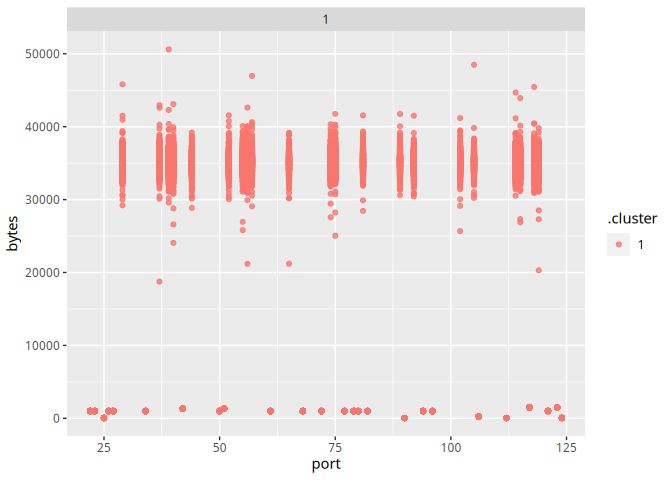

``` r
library(stringr)
library(tidymodels)
library(arrow)
library(dplyr)
library(ggplot2)
```

# Задание 3: Надите утечку данных 3

Еще один нарушитель собирает содержимое электронной почты и отправляет в
Интернет используя порт, который обычно используется для другого типа
трафика. Атакующий пересылает большое количество информации используя
этот порт, которое нехарактерно для других хостов, использующих этот
номер порта. Определите IP этой системы. Известно, что ее IP адрес
отличается от нарушителей из предыдущих задач.

## Импортируем датасет

``` r
df_data <- arrow::read_csv_arrow("/home/archer/Documents/ML/traffic_security.csv")
```

## Дадим имена признакам

``` r
colnames(df_data) <- c('timestamp','src','dst','port','bytes')
head(df_data,3)
```

    ## # A tibble: 3 × 5
    ##       timestamp src           dst           port bytes
    ##         <int64> <chr>         <chr>        <int> <int>
    ## 1 1578326400005 16.79.101.100 12.48.65.39     92 11895
    ## 2 1578326400007 18.43.118.103 14.51.30.86     27   898
    ## 3 1578326400011 15.71.108.118 14.50.119.33    57  7496

## Очистим датасет, оставив в src ip-адреса, только нашего предприятия

``` r
knitr::opts_chunk$set(
  df_data <- df_data[df_data$src > 11 & df_data$src < 15 & df_data$dst < 11 | df_data$dst > 15, ]
)
```

## Удаление IP из задания 1

``` r
knitr::opts_chunk$set(
  df_data <- df_data[!(df_data$src=="13.37.84.125"),]
)
head(df_data,3)
```

    ## # A tibble: 3 × 5
    ##       timestamp src           dst          port bytes
    ##         <int64> <chr>         <chr>       <int> <int>
    ## 1 1578326400012 14.33.30.103  15.24.31.23   115 20979
    ## 2 1578326400018 12.46.104.126 16.25.76.33   123  1500
    ## 3 1578326400021 12.43.98.93   18.85.31.68    79   979

## Извлечение часов

``` r
knitr::opts_chunk$set(
  df_data$timestamp <- as.POSIXct(df_data$timestamp/1000, origin = "1970-01-01", tz = "GMT")
)
head(df_data,3) 
```

    ## # A tibble: 3 × 5
    ##   timestamp           src           dst          port bytes
    ##   <dttm>              <chr>         <chr>       <int> <int>
    ## 1 2020-01-06 16:00:00 14.33.30.103  15.24.31.23   115 20979
    ## 2 2020-01-06 16:00:00 12.46.104.126 16.25.76.33   123  1500
    ## 3 2020-01-06 16:00:00 12.43.98.93   18.85.31.68    79   979

## Удаление NA

``` r
knitr::opts_chunk$set(
  df_data <- na.omit(df_data)
)
```

## Разбиваем время на часы минуты и секунды

``` r
knitr::opts_chunk$set(
  df_data$hour <- with (df_data,format(as.POSIXct(df_data$timestamp), format = "%H")),
  df_data$minutes <- with (df_data,format(as.POSIXct(df_data$timestamp), format = "%M")),
  df_data$sec <- with (df_data,format(as.POSIXct(df_data$timestamp), format = "%S"))
)
head(df_data,3)
```

    ## # A tibble: 3 × 8
    ##   timestamp           src           dst          port bytes hour  minutes sec  
    ##   <dttm>              <chr>         <chr>       <int> <int> <chr> <chr>   <chr>
    ## 1 2020-01-06 16:00:00 14.33.30.103  15.24.31.23   115 20979 16    00      00   
    ## 2 2020-01-06 16:00:00 12.46.104.126 16.25.76.33   123  1500 16    00      00   
    ## 3 2020-01-06 16:00:00 12.43.98.93   18.85.31.68    79   979 16    00      00

## Удаление IP из задания 2

``` r
knitr::opts_chunk$set(
  df_data <- df_data[!(df_data$src=="12.55.77.96"),]
)
head(df_data,3)
```

    ## # A tibble: 3 × 8
    ##   timestamp           src           dst          port bytes hour  minutes sec  
    ##   <dttm>              <chr>         <chr>       <int> <int> <chr> <chr>   <chr>
    ## 1 2020-01-06 16:00:00 14.33.30.103  15.24.31.23   115 20979 16    00      00   
    ## 2 2020-01-06 16:00:00 12.46.104.126 16.25.76.33   123  1500 16    00      00   
    ## 3 2020-01-06 16:00:00 12.43.98.93   18.85.31.68    79   979 16    00      00

## Извлекаем часы и байты

``` r
knitr::opts_chunk$set(
  df_data_ports_bytes <- tibble(src = df_data$src,
                                port = df_data$port,
                                bytes = df_data$bytes)
  
)
head(df_data_ports_bytes,3)
```

    ## # A tibble: 3 × 3
    ##   src            port bytes
    ##   <chr>         <int> <int>
    ## 1 14.33.30.103    115 20979
    ## 2 12.46.104.126   123  1500
    ## 3 12.43.98.93      79   979

## Группируем по портам

``` r
knitr::opts_chunk$set(
df_data_ports_bytes <- df_data_ports_bytes %>%
            group_by(src, port) %>%
            summarise(bytes = mean(bytes)),

df_data_ports_bytes <- tibble(port = df_data_ports_bytes$port,
                              bytes = df_data_ports_bytes$bytes)
)
head(df_data_ports_bytes,3)
```

    ## # A tibble: 3 × 2
    ##    port bytes
    ##   <int> <dbl>
    ## 1    22  995.
    ## 2    23 1000.
    ## 3    25   42

## Кластерезуем

``` r
knitr::opts_chunk$set(
  kclust <- kmeans(na.omit(df_data_ports_bytes), centers = 2)
)
```

## Эксперимент с кол-вом кластеров

``` r
knitr::opts_chunk$set(
  kclusts <-
    tibble(k = 1) %>%
    mutate(
      kclust = map(k, ~kmeans(df_data_ports_bytes, .x)),
      tidied = map(kclust, tidy),
      glanced = map(kclust, glance),
      augmented = map(kclust, augment, df_data_ports_bytes)
    )
)
```

``` r
knitr::opts_chunk$set(
  clusters <-
    kclusts %>%
    unnest(cols = c(tidied)),
  
  assigments <-
    kclusts %>%
    unnest(cols = c(augmented)),
    
  clusterings <-
    kclusts %>%
    unnest(cols = c(glanced))
)
```

### Графический вид

``` r
knitr::opts_chunk$set(
plot1 <-
  ggplot(assigments, aes(x = port, y = bytes)) +
  geom_point(aes(color = .cluster), alpha = 0.8) +
  facet_wrap(~ k)
)
plot1
```



### Поиск IP по 39 порту

``` r
df_data_ports_bytes <- tibble(src = df_data$src,
                              port = df_data$port,
                              bytes = df_data$bytes)

df_data_ports_bytes <- df_data_ports_bytes %>%
            group_by(src, port) %>%
            summarise(bytes = mean(bytes))

df_data_ports_bytes <- df_data_ports_bytes[df_data_ports_bytes$port=="39",]

found_ip3 <- df_data_ports_bytes %>%
          group_by(src, port) %>%
          summarise(bytes = mean(bytes))

found_ip3 <- found_ip3[which.max(found_ip3$bytes),]

print(found_ip3) 
```

    ## # A tibble: 1 × 3
    ## # Groups:   src [1]
    ##   src           port  bytes
    ##   <chr>        <int>  <dbl>
    ## 1 13.36.102.77    39 50597.

Ответ: 13.36.102.77
